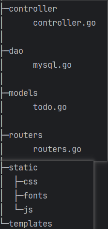

<aside>
💡

本项目是一个精简的待办事项web，主要用于学习 gin+gorm+mysql 项目的组织架构。

</aside>

## 一、目录结构

项目目录结构如下：



- controller：控制器，处理路由请求，调用model层对数据进行操作
- dao：数据库底层操作
- models：业务逻辑，增删改查，通过gorm操作底层数据库连接
- routers：定义路由

## 二、具体流程

项目从主目录下的main.go文件进入，主要代码如下：

```go
package main

import (
	"bubble/dao"
	"bubble/routers"
)

func main() {
	// 创建数据库
	// sql: CREATE DATABASE bubble;
	// 连接数据库 & 模型绑定
	err := dao.InitMySQL()
	if err != nil {
		panic(err)
	}
	defer dao.Close() // 程序退出关闭数据库连接
	// 注册路由
	r := routers.SetupRouter()
	r.Run(":9090")
}

```

前提：数据库已创建

main.go 文件中主要进行了下列操作：

1. 初始化数据库连接
2. 创建gin示例，注册路由

### 1. 初始化数据库连接

在dao目录下的mysql.go文件中进行数据库的初始化连接操作，详情见具体代码：

```go
package dao

import (
	_ "github.com/go-sql-driver/mysql"
	"github.com/jinzhu/gorm"
	"log"
)

var (
	DB *gorm.DB
)

func InitMySQL() (err error) {
	dsn := "root:123456@(localhost)/mydb?charset=utf8mb4&parseTime=True&loc=Local"
	DB, err = gorm.Open("mysql", dsn)
	if err != nil {
		log.Fatal("Failed to open database:", err)
	}
	// 测试与数据库的连接是否仍然 存在
	// DB()返回一个sql.DB类型的指针
	// Ping()方法用于测试与数据库的连接是否仍然存在
	return DB.DB().Ping()
}

func Close() {
	DB.Close()
}
```

初始化语句接收error返回值，若初始化连接失败，则会报panic。然后使用defer语句，确保程序退出时会关闭数据库连接。

### 2. 注册路由

<aside>
💡

路由层：定义HTTP请求的URL路径和HTTP方法，并将其与处理该请求的控制器函数关联起来。

</aside>

调用routers下的routers.go文件进行路由的注册工作，主要进行了下列操作：

- 创建带有默认中间件的新gin示例

    ```go
    // 默认的中间件包括Logger中间件和Recovery中间件
    r := gin.Default()
    ```

- 绑定模板文件以及其引用的静态文件路径

    ```go
    	// 告诉gin框架模板文件引用的静态文件去哪里找
    	r.Static("/static", "static")
    	// 告诉gin框架去哪里找模板文件
    	r.LoadHTMLGlob("templates/*")
    ```

- 为路由绑定处理函数

    ```go
    // 为路由绑定处理函数
    r.GET("/", controller.IndexHandler)
    ```

  处理函数定义如下：

    ```go
    func IndexHandler(c *gin.Context) {
    	c.HTML(http.StatusOK, "index.html", nil)
    }
    ```

- 创建具体业务的路由分组，并关联控制器函数

    ```go
    	// 创建路由分组v1
    	v1Group := r.Group("v1")
    	{
    		// 待办事项
    		// 添加
    		v1Group.POST("/todo", controller.CreateTodo)
    		// 查看所有的待办事项
    		v1Group.GET("/todo", controller.GetTodoList)
    		// 修改某一个待办事项
    		v1Group.PUT("/todo/:id", controller.UpdateATodo)
    		// 删除某一个待办事项
    		v1Group.DELETE("/todo/:id", controller.DeleteATodo)
    	}
    ```


所有代码如下：

```go
package routers

import (
	"bubble/controller"
	"github.com/gin-gonic/gin"
)

/*
路由层：在路由层中，我们定义HTTP请求的URL路径和HTTP方法，并将其与处理该请求的控制器函数关联起来。
*/

func SetupRouter() *gin.Engine {
	// 创建一个带有默认中间件的新的gin示例，包括Logger中间件和Recovery中间件
	r := gin.Default()
	// 告诉gin框架模板文件引用的静态文件去哪里找
	r.Static("/static", "static")
	// 告诉gin框架去哪里找模板文件
	r.LoadHTMLGlob("templates/*")
	// 为路由绑定处理函数
	r.GET("/", controller.IndexHandler)

	// 创建路由分组v1
	v1Group := r.Group("v1")
	{
		// 待办事项
		// 添加
		v1Group.POST("/todo", controller.CreateTodo)
		// 查看所有的待办事项
		v1Group.GET("/todo", controller.GetTodoList)
		// 修改某一个待办事项
		v1Group.PUT("/todo/:id", controller.UpdateATodo)
		// 删除某一个待办事项
		v1Group.DELETE("/todo/:id", controller.DeleteATodo)
	}
	return r
}

```

### 3. 业务控制

url     —> controller —> logic        —> model

请求 —> 控制器       —>业务逻辑 —> 模型层的增删改查

<aside>
💡

控制器层：控制器层负责处理HTTP请求并进行业务逻辑处理。通常会从请求中获取参数、调用服务层进行数据操作、对返回的结果进行封装后返回给客户端。

</aside>

控制器层就是定义处理各个路由请求的控制器函数：

1. 增

    ```go
    func CreateTodo(c *gin.Context) {
    	// 前端页面填写待办事项 点击请求 会发请求到这里
    	// 1. 从请求中把数据拿出来
    	var todo models.Todo
    	// BindJSON()用于从请求中获取JSON数据并将其绑定到指定的Go结构体变量&todo上
    	if err := c.ShouldBind(&todo); err != nil {
    		c.JSON(http.StatusBadRequest, gin.H{"error": err.Error()})
    		return
    	}
    	// 2. 存入数据库
    	if err := models.CreateATodo(&todo); err != nil {
    		c.JSON(http.StatusOK, gin.H{"error": err.Error()})
    	} else {
    		// 直接返回结构体todo，返回的格式与定义的结构体格式一致
    		//c.JSON(http.StatusOK, todo)
    		// 返回自定义构建的json结构体
    		c.JSON(http.StatusOK, gin.H{
    			"status": 200,
    			"msg":    "success",
    			"data":   todo,
    		})
    	}
    }
    ```

2. 删

    ```go
    func DeleteATodo(c *gin.Context) {
    	id, ok := c.Params.Get("id")
    	if !ok {
    		c.JSON(http.StatusOK, gin.H{"error": "无效的id"})
    		return
    	}
    	if err := models.DeleteATodo(id); err != nil {
    		c.JSON(http.StatusOK, gin.H{"error": err.Error()})
    	} else {
    		//c.JSON(http.StatusOK, gin.H{id: "deleted"})
    		c.JSON(http.StatusOK, gin.H{
    			"status": 200,
    			"msg":    "success",
    			"data":   struct{ ID string }{ID: "deleted"},
    		})
    	}
    }
    ```

3. 改

    ```go
    func UpdateATodo(c *gin.Context) {
    	id, ok := c.Params.Get("id")
    	if !ok {
    		c.JSON(http.StatusOK, gin.H{"error": "无效的id"})
    		return
    	}
    	todo, err := models.GetATodo(id)
    	if err != nil {
    		c.JSON(http.StatusOK, gin.H{"error": err.Error()})
    		return
    	}
    	c.BindJSON(&todo)
    	if err = models.UpdateATodo(todo); err != nil {
    		c.JSON(http.StatusOK, gin.H{"error": err.Error()})
    	} else {
    		//c.JSON(http.StatusOK, todo)
    		c.JSON(http.StatusOK, gin.H{
    			"status": 200,
    			"msg":    "success",
    			"data":   todo,
    		})
    	}
    }
    ```

4. 查

    ```go
    func GetTodoList(c *gin.Context) {
    	// 查询todo这个表里的所有数据
    	todoList, err := models.GetAllTodo()
    	if err != nil {
    		c.JSON(http.StatusOK, gin.H{"error": err.Error()})
    	} else {
    		//c.JSON(http.StatusOK, todoList)
    		c.JSON(http.StatusOK, gin.H{
    			"status": 200,
    			"msg":    "success",
    			"data":   todoList,
    		})
    	}
    }
    ```


### 4. 数据库操作

model层通过dao层声明的gorm指针对底层数据库进行操作

1. 增

    ```go
    // CreateATodo 创建todo
    func CreateATodo(todo *Todo) (err error) {
    	err = dao.DB.Create(&todo).Error
    	return
    }
    ```

2. 删

    ```go
    func DeleteATodo(id string) (err error) {
    	err = dao.DB.Where("id=?", id).Delete(&Todo{}).Error
    	return
    }
    ```

3. 查

    ```go
    func GetAllTodo() (todoList []*Todo, err error) {
    
    	if err = dao.DB.Find(&todoList).Error; err != nil {
    		return nil, err
    	}
    	return
    
    }
    
    func GetATodo(id string) (todo *Todo, err error) {
    	todo = new(Todo)
    	if err = dao.DB.Where("id=?", id).First(todo).Error; err != nil {
    		return nil, err
    	}
    	return
    }
    ```

4. 改

    ```go
    func UpdateATodo(todo *Todo) (err error) {
    	err = dao.DB.Save(todo).Error
    	return
    }
    ```


所有代码：

```go
package models

import (
	"bubble/dao"
)

// Todo Model
type Todo struct {
	ID     int    `json:"id"`
	Title  string `json:"title"`
	status bool   `json:"status"`
}

/*
	Todo这个Model的增删改查操作都放在这里
*/
// CreateATodo 创建todo
func CreateATodo(todo *Todo) (err error) {
	err = dao.DB.Create(&todo).Error
	return
}

func GetAllTodo() (todoList []*Todo, err error) {

	if err = dao.DB.Find(&todoList).Error; err != nil {
		return nil, err
	}
	return

}

func GetATodo(id string) (todo *Todo, err error) {
	todo = new(Todo)
	if err = dao.DB.Where("id=?", id).First(todo).Error; err != nil {
		return nil, err
	}
	return
}

func UpdateATodo(todo *Todo) (err error) {
	err = dao.DB.Save(todo).Error
	return
}

func DeleteATodo(id string) (err error) {
	err = dao.DB.Where("id=?", id).Delete(&Todo{}).Error
	return
}
```